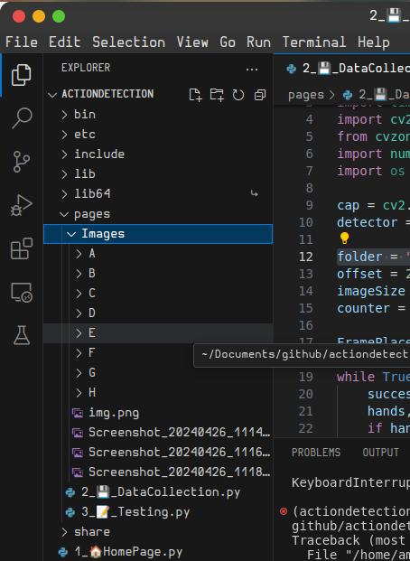
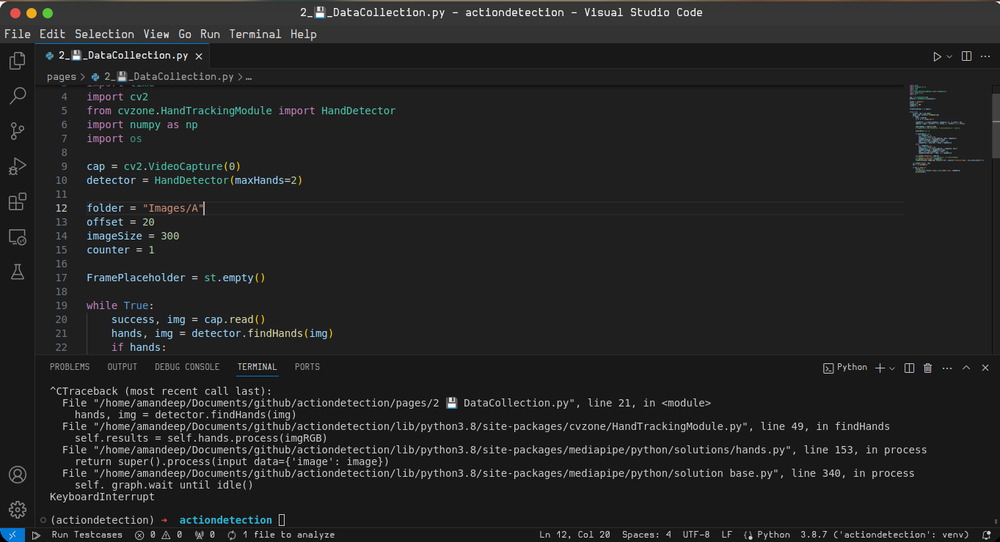
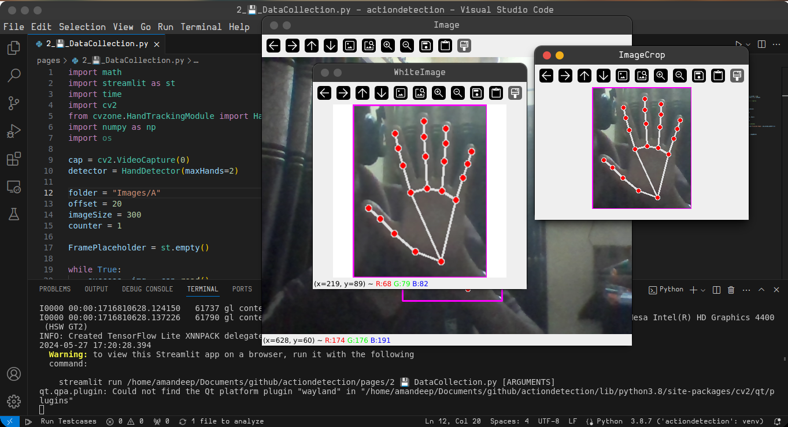

# So this is how to save images

specify the folder you have to save in , i prefer it folder to named as Images which will be along side of datacollection program 
## 
so when you run datacollection in your environment you can create all alphbets inside the image folder like in below code so when it will be rough to create all alphabets folder so you can feel free to optimize the code using os module
##
 
##
basically this below code line does in your datacollection python file is Images is where all images are stored A is specified a which hand sign i am doing if would be doing B I will be using "Images/B"
## 
`folder = "Images/A"`
##

##

## Now the final part how to save images 
now you will run this program and get a blank stare for a moment don't worry if your python verion matches i have then the program will run smoothly \
[python 3.8.7](https://www.python.org/downloads/release/python-387/)
\
if you are using linux and don't know how to install from tarball please comment this i will add that part too 
#
cvzone -- 1.5.6 
# 
tensorflow -- 2.9.1 
#
streamlit -- 1.33.0
## now you will greeted with your face which will make you sad tho but the program works so congrats
i have covered my face so i'm not that sad 

now you will press "s" inorder to save image to your preferred directory \
`folder = "Images/A"`
