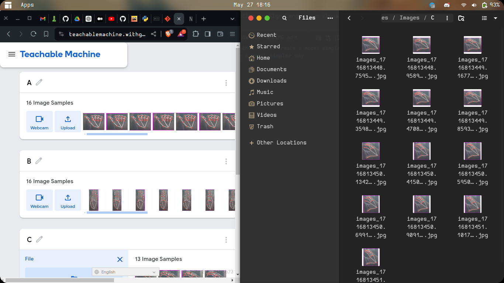
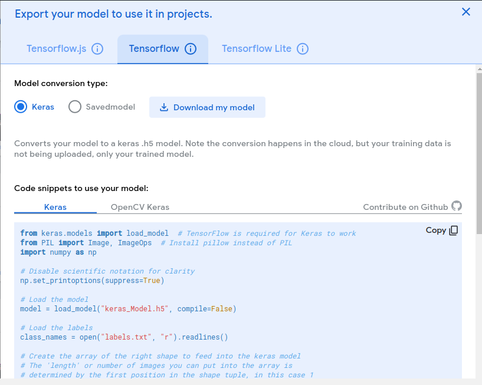
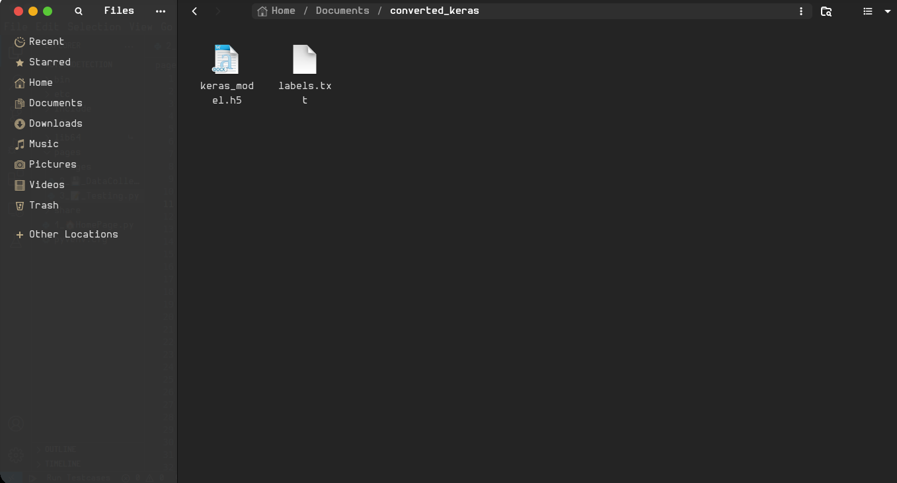
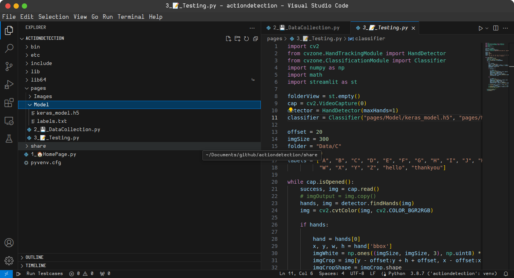
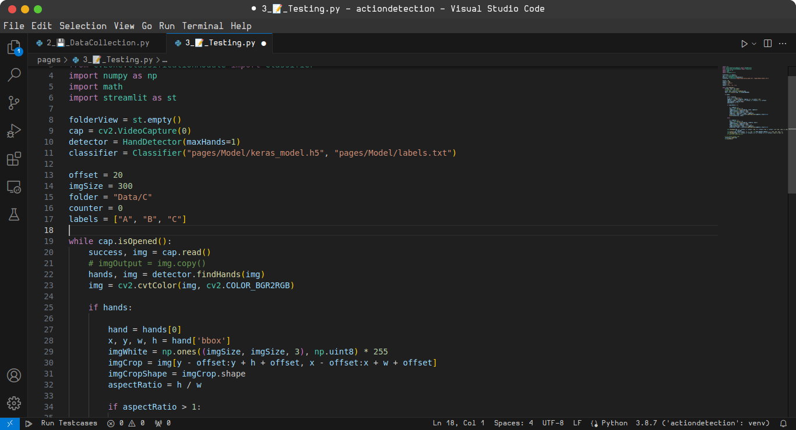

# So this how to create a model simpler way 
once you have the images saved from datacollection python file go to [teachable machine](https://teachablemachine.withgoogle.com/train)
#
Select "*image project*" then after select "*standard image model*"
then create classes as many words or letter you are using 
#

#
this done then click on *"train model"* please notice that how many images folder your have added cause it will be needed in further process for now i have images of three alphabets ("A" , "B", "C")
# 
then after this process export the model from from there please select the options i have selected in the below image
#

# 
then after selection please please download the model and extract it you will be welcomed by these two files
# 

## please copy these files into pages/Model directory just like i have done

### then after that i have told you that how much images classes we have created so i created our model for = ("A" , "B", "C") now we will use this list in our testing python file 

we will use this list as in labels for labelling our images 
# 

#
notice that in this screenshot labels list is how much letters we have created model with this should match with "pages/Model/labels.txt" which is obtained from extracting the model zip 
and note that path that i mentoined should be correct 
# 
please leave me comment if you run into a error