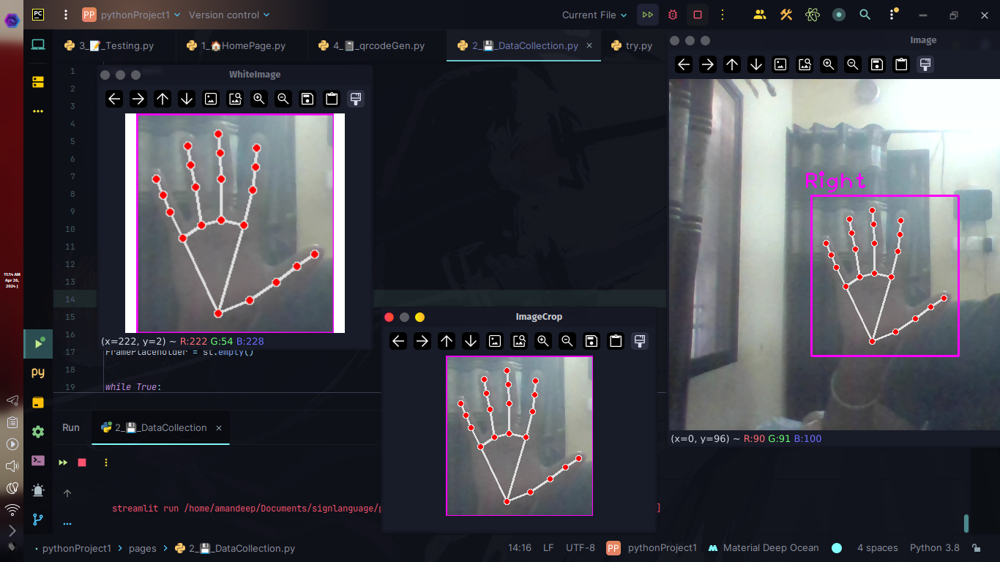
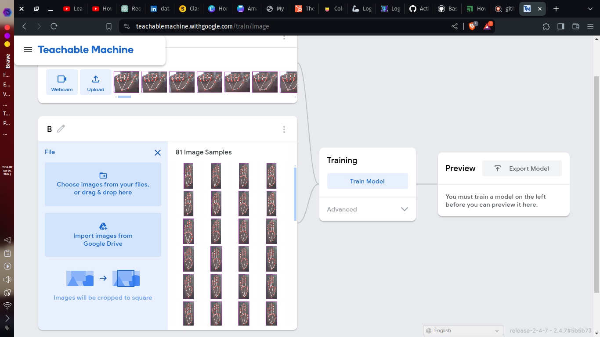
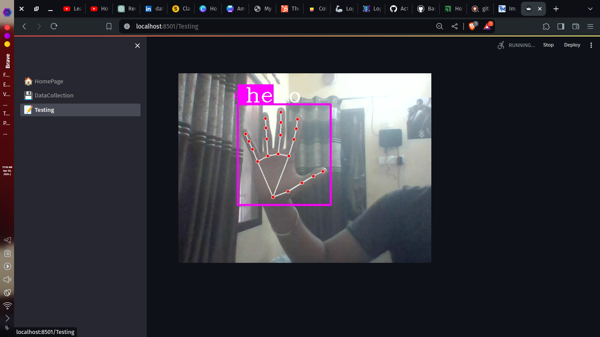

# Action_Detection_on_Sign_Language

> ***Although the world is full of suffering . It is also full of overcoming of it***

## Indian Sign Language -->

1. ISL uses both hands similar to British Sign Language and is similar to International Sign Language.
2. ISL alphabets derived from British Sign Language and French Sign Language alphabets
3. Unlike its american counterpart which uses one hand, uses both hands to represent alphabets.

# How can anyone use this code
- Go to pages directory for Creating your ouwn images and running it in your Environment i have mentioned that version of each libraries i have used (Pressing s can save your images in path you have given )
##
{width=100px}
##
- After you are  done with image collection [Create your model here ](https://teachablemachine.withgoogle.com/)
  ##

  ##
- Create class name same as what sign you are putting it.
- Download the model and test it in code provided in pages testing
- Now run the code Named tesing in pages folder
##

##
# Methodology - 

### Step - 1
- So we are trying to create a web app that will help our friend that are specially disabled ,who cannot hear so they uses sign language so we will detect their hand gesture and make our communication easier
- So we will start with American Standard Sign Language and create our data

### Step - 2
- So we will be creating our hand sign data based on ASL(American Standard Sign Language), That will be our first step for Achieving ISL because ASL uses one hand gesture that will be easy for us
- After we have created our data based on ASL and training our model has been complete then only we will be moving towards ISL

### Step - 3
- We'll look at the sign language data and figure out what parts are important for recognizing gestures. This might include things like where the hands are moving and how fast they're moving.

### Step - 4
- We'll pick the best ways to teach the computer to recognize sign language gestures. This might involve using fancy math and algorithms or just lots of examples.
- We have to use enough examples for our this process

### Step - 5
- Now we will test our trained model which is prepared on images we have clicked so now we will 
                 test it out in out **test.py** 
- After we have tested our data on user input in ASL we will be continue to ISL data creation and "
                 "testing

# Imported Libraries
```
import math
import streamlit as st
import time
import cv2
from cvzone.HandTrackingModule import HandDetector
import numpy as np

```
cvzone -- 1.5.6
tensorflow -- 2.9.1
streamlit -- 1.33.0
